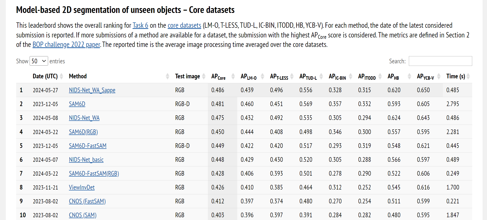

<div align="center">
<h2>
NIDS-Net: A unified framework for Novel Instance Detection and Segmentation
</h2>

This repo of NIDS-Net is based on [CNOS](https://github.com/nv-nguyen/cnos) and [SAM6D](https://github.com/JiehongLin/SAM-6D). It generates the novel instance detection and segmentation (NIDS) results for the BOP challenge.
**The code has been merged into** this [NIDS-Net github repo](https://github.com/YoungSean/NIDS-Net).

[arXiv](https://arxiv.org/abs/2405.17859), [Project](https://irvlutd.github.io/NIDSNet/)


## Framework


## Foreground Feature Averaging (FFA)
[FFA](https://github.com/s-tian/CUTE) is used to generate the initial embeddings in our framework.


## Segmentation Example

</h3>
</div>

## BOP Benchmark
[Ranked #1: Model-based 2D segmentation of unseen objects – Core datasets](https://bop.felk.cvut.cz/leaderboards/segmentation-unseen-bop23/core-datasets/). 


If you find the method useful in your research, please consider citing:
```latex
@misc{lu2024adapting,
      title={Adapting Pre-Trained Vision Models for Novel Instance Detection and Segmentation}, 
      author={Yangxiao Lu and Jishnu Jaykumar P and Yunhui Guo and Nicholas Ruozzi and Yu Xiang},
      year={2024},
      eprint={2405.17859},
      archivePrefix={arXiv},
      primaryClass={cs.CV}
}
```


## Installation 

<details><summary>Click to expand</summary>

We first follow [CNOS](https://github.com/nv-nguyen/cnos) to create the environment. 

### 1. Create conda environment
```
conda env create -f environment.yml
conda activate cnos

# for using SAM
pip install git+https://github.com/facebookresearch/segment-anything.git

# for using fastSAM
pip install ultralytics==8.0.135
```
Then install grounded-SAM for [NIDS-Net github repo](https://github.com/YoungSean/NIDS-Net).
```shell
pip install -r requirements.txt
conda install pytorch torchvision torchaudio pytorch-cuda=11.8 -c pytorch -c nvidia
python setup.py install
python -m pip install 'git+https://github.com/facebookresearch/detectron2.git'
```

### 2. Datasets and model weights

Please follow [CNOS](https://github.com/nv-nguyen/cnos?tab=readme-ov-file#2-datasets-and-model-weights) to download the datasets and model weights.

We mainly use the template images from BlenderProc4BOP set due to its better performance. The dataest is used to generate template embeddings. We will upload the template embeddings soon. So you can use these template embeddings to train the adapter. 

If you just need template embeddings for matching, you do **not** need to download the datasets for inference.

Make sure there is ViT-H SAM weights in the folder "ckpts/sam_weights/sam_vit_h_4b8939.pth". 
#### Download [ViT-H SAM weights](https://github.com/facebookresearch/segment-anything#model-checkpoints)
```shell
wget https://dl.fbaipublicfiles.com/segment_anything/sam_vit_h_4b8939.pth
```
After installation, there will be a folder named "ckpts". Move the SAM weight to "ckpts/sam_weights/sam_vit_h_4b8939.pth".
```shell
mkdir ckpts/sam_weights
mv sam_vit_h_4b8939.pth ckpts/sam_weights
```


</details>

##  Inference on [BOP datasets](https://bop.felk.cvut.cz/datasets/)

Access NIDS-Net's prediction results, template embeddings and the adapter model weight for seven BOP benchmark datasets [here](https://utdallas.box.com/s/yw8oazutnp1ektcnzh3hm8u5vjtq7to7).

Before running the inference, please download the template embeddings and adapter model weight from the link above. You may modify the [model weight path](https://github.com/YoungSean/NIDS-Net-BOP/blob/main/src/model/detector.py#L196) and [the adapted template embedding path](https://github.com/YoungSean/NIDS-Net-BOP/blob/main/src/model/detector.py#L220) in the model file.

<details><summary>Click to expand</summary>

1. Train the weight adapter.
You may change the folder path in the following python scripts. These paths are pointing to initial instance template embeddings.
```shell
python obj_adapter.py
# now you train a common adapter for all datasets
# Then you can use the adapter to generate the adapter template embeddings for the BOP datasets
# the following python script will generate the adapter template embeddings.
python transforme_adapter_feats.py
```

2. Run NIDS-Net to get predictions of a BOP dataset:

```
export DATASET_NAME=lmo 
# adding CUDA_VISIBLE_DEVICES=$GPU_IDS if you want to use a specific GPU

# with Grounded-SAM + PBR
python run_inference.py dataset_name=$DATASET_NAME

# using smaller models for FastSAM and DINOv2
python run_inference.py dataset_name=$DATASET_NAME model=cnos_fast model.descriptor_model.model_name=dinov2_vits14 model.segmentor_model.checkpoint_path=

```
Once the script completes, NIDS-Net will generate a prediction file at this [directory](https://github.com/YoungSean/Novel-Instance-Detection-BOP/blob/840d10ea4954cf9e6e4a77f2a4c49ada005406b6/configs/run_inference.yaml#L10). You can then assess the prediction on the [BOP Challenge website](https://bop.felk.cvut.cz/).

3. Prediction Visualization with Detectron2

Display masks, object IDs, and scores using Detectron2.
```
python -m src.scripts.visualize_detectron2 dataset_name=$DATASET_NAME input_file=$INPUT_FILE output_dir=$OUTPUT_DIR
```
</details>


## Acknowledgement
- [CNOS](https://github.com/nv-nguyen/cnos)
- [SAM](https://github.com/facebookresearch/segment-anything)
- [DINOv2](https://github.com/facebookresearch/dinov2)
- [SAM6D](https://github.com/JiehongLin/SAM-6D)
- [FFA](https://github.com/s-tian/CUTE) 


## Contact Informantion
For questions, feel free to create an issue or email yangxiao.lu@utdallas.edu .